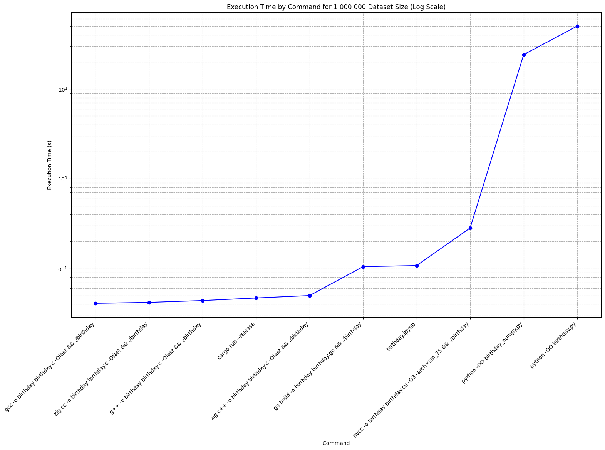
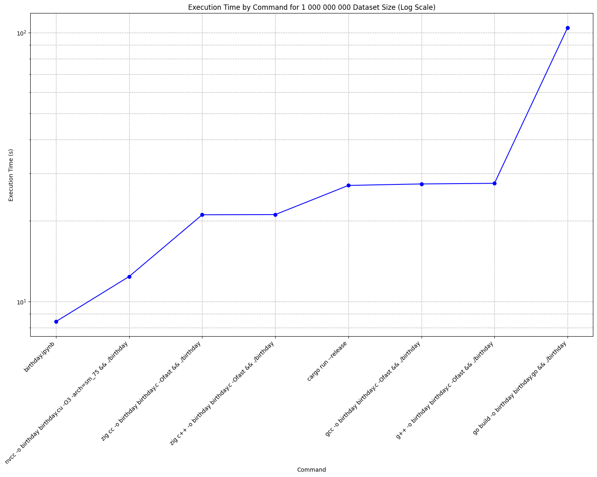

# Programming Languages Benchmark

This repository conducts a simulation of classes consisting of 24 people to search for matches where exactly two people share the same birthday.

## Performance Comparison

### Simulation with 1,000,000 Iterations

**First Conclusion:** Python demonstrates slow performance.

### Simulation with 1,000,000,000 Iterations

**Second Conclusion:** CUDA exhibits super-fast performance.

## Description

This benchmark was conducted on various hardware configurations and programming languages:

### Google Colab Tesla T4 16GB

#### CUDA
- `birthday.ipynb`

### Ryzen 5 1600 + 1660 Super

#### CUDA
- Compilation: `nvcc -o birthday birthday.cu -O3 -arch=sm_75`
- Execution: `./birthday`

#### Rust
- Optimized Run: `cargo run --release`

#### C Compiled as C++ using GNU Compiler
- Compilation: `g++ -o birthday birthday.c -Ofast`
- Execution: `./birthday`

#### C Compiled as C using GNU Compiler
- Compilation: `gcc -o birthday birthday.c -Ofast`
- Execution: `./birthday`

#### Go
- Compilation: `go build -o birthday birthday.go`
- Execution: `./birthday`

#### Python
- Optimized Execution: `python -OO birthday.py`

#### Python using NumPy
- Optimized Execution: `python -OO birthday_numpy.py`

#### C Compiled as C++ using Zig Compiler
- Compilation: `zig c++ -o birthday birthday.c -Ofast`
- Execution: `./birthday`

#### C Compiled as C using Zig Compiler
- Compilation: `zig cc -o birthday birthday.c -Ofast`
- Execution: `./birthday`

## License

MIT