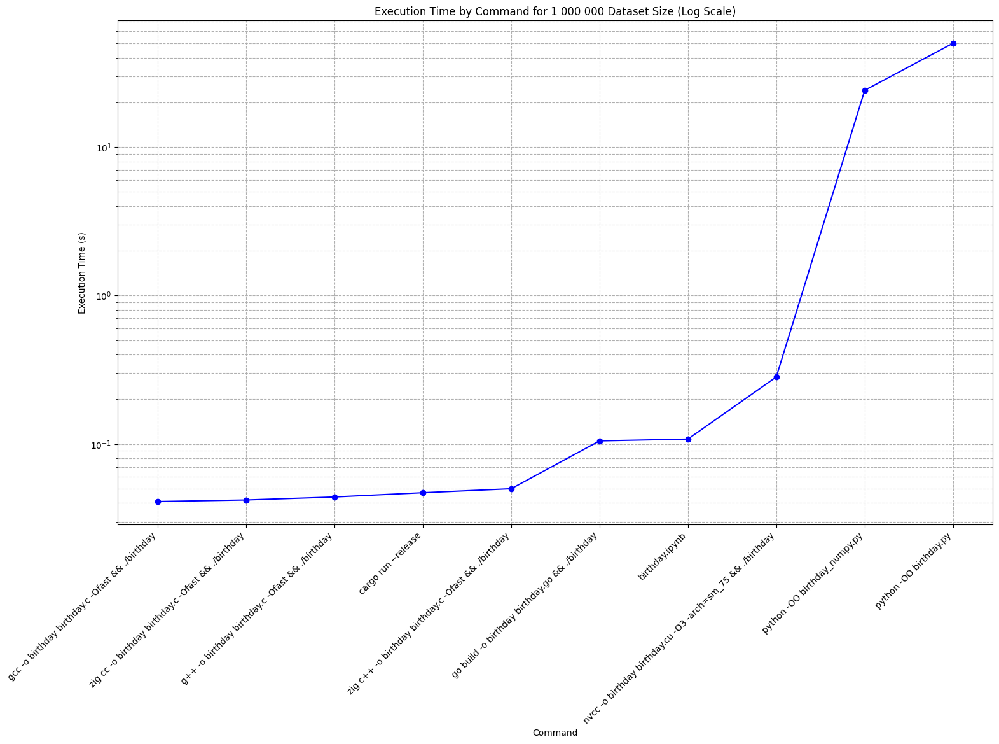
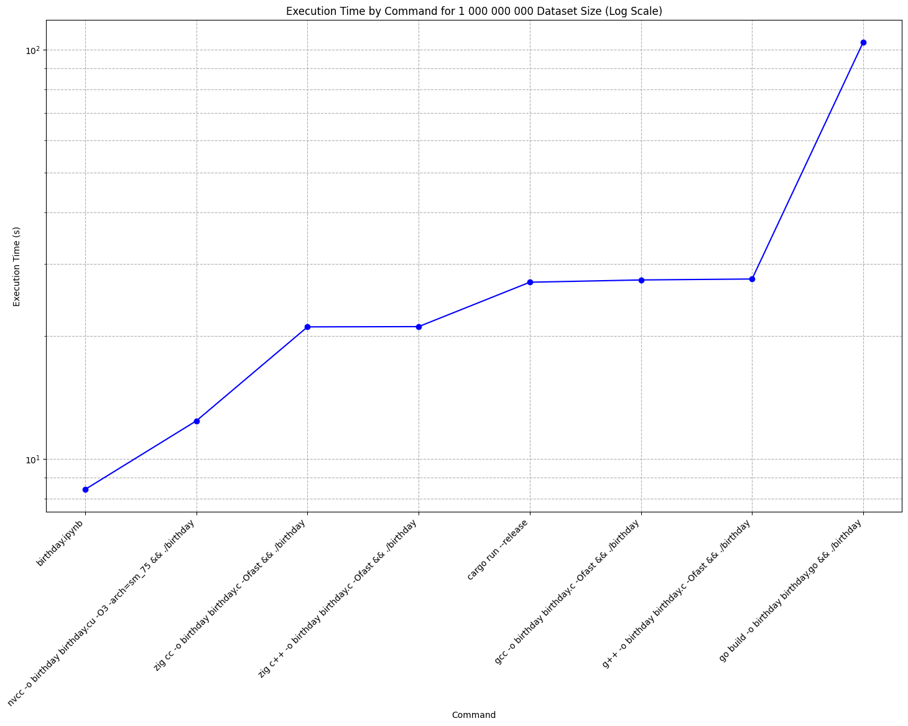
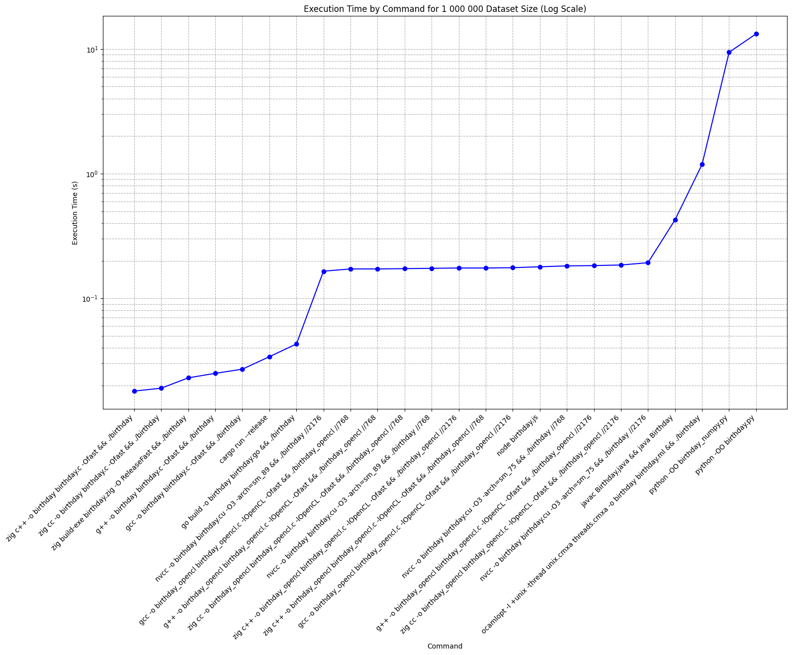
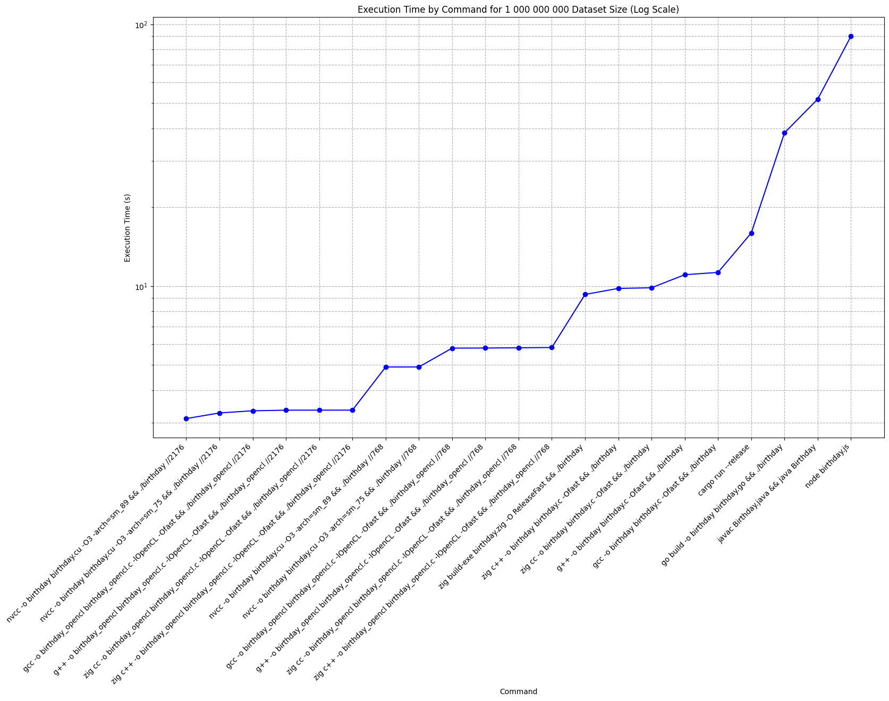

# Programming Languages Benchmark

This repository conducts a simulation of classes consisting of 24 people to search for matches where exactly two people share the same birthday.

## 📈 Performance Comparison

In March 2024, the project started with Python, C, CUDA, Rust, and Go implementations and was tested on AMD Ryzen 5 1600 (AF), NVIDIA GTX 1660 Super, and Google Colab's NVIDIA Tesla T4 with the following results:

### Simulation with 1,000,000 Iterations

**First Conclusion:** Python demonstrates slow performance.

### Simulation with 1,000,000,000 Iterations

**Second Conclusion:** CUDA exhibits super-fast performance.

In October 2025, Java, OCaml, Zig, OpenCL, and JavaScript implementations were added and tested on Intel Core Ultra 7 155H and NVIDIA RTX 4060 Ti 16 GB with the following results:

### Simulation with 1,000,000 Iterations

### Simulation with 1,000,000,000 Iterations

**Conclusion:** It seems necessary to rewrite existing implementations to make them use the same random function, probably LCG for simplicity, as Xoshiro, despite its potential speed, as well as PCG, despite its statistical goodness, may be too slow to implement in interpreted languages.

## 📖 Usage Examples

This benchmark was conducted on various hardware configurations and programming languages:

### Google Colab Tesla T4 16GB

#### CUDA
- `birthday.ipynb`

### Ryzen 5 1600 + 1660 Super

#### CUDA
- Compilation: `nvcc -o birthday birthday.cu -O3 -arch=sm_75`
- Execution: `./birthday`

#### Rust
- Optimized Run: `cargo run --release`

#### C Compiled as C++ using GNU Compiler
- Compilation: `g++ -o birthday birthday.c -Ofast`
- Execution: `./birthday`

#### C Compiled as C using GNU Compiler
- Compilation: `gcc -o birthday birthday.c -Ofast`
- Execution: `./birthday`

#### Go
- Compilation: `go build -o birthday birthday.go`
- Execution: `./birthday`

#### Python
- Optimized Execution: `python -OO birthday.py`

#### Python using NumPy
- Optimized Execution: `python -OO birthday_numpy.py`

#### C Compiled as C++ using Zig Compiler
- Compilation: `zig c++ -o birthday birthday.c -Ofast`
- Execution: `./birthday`

#### C Compiled as C using Zig Compiler
- Compilation: `zig cc -o birthday birthday.c -Ofast`
- Execution: `./birthday`

### Core Ultra 7 155H + 4060 Ti 16 GB

#### Java
- Compilation: `javac Birthday.java`
- Execution: `java Birthday.java`

#### OCaml
- Compilation: `ocamlopt -I +unix -thread unix.cmxa threads.cmxa -o birthday birthday.ml`
- Execution: `./birthday`

#### Zig
- Compilation: `zig build-exe birthday.zig -O ReleaseFast`
- Execution: `./birthday`

#### JavaScript
- Execution: `node birthday.js`

#### OpenCL Compiled as C++ using GNU Compiler
- Compilation: `g++ -o birthday_opencl birthday_opencl.c -lOpenCL -Ofast`
- Execution: `./birthday_opencl`

#### OpenCL Compiled as C using GNU Compiler
- Compilation: `gcc -o birthday_opencl birthday_opencl.c -lOpenCL -Ofast`
- Execution: `./birthday_opencl`

#### OpenCL Compiled as C++ using Zig Compiler
- Compilation: `zig c++ -o birthday_opencl birthday_opencl.c -lOpenCL -Ofast`
- Execution: `./birthday_opencl`

#### OpenCL Compiled as C using Zig Compiler
- Compilation: `zig cc -o birthday_opencl birthday_opencl.c -lOpenCL -Ofast`
- Execution: `./birthday_opencl`

#### C++ Compiled using GNU Compiler
- Compilation: `g++ -o birthday birthday.cpp -Ofast`
- Execution: `./birthday`

#### C++ Compiled using Zig Compiler
- Compilation: `zig c++ -o birthday birthday.cpp -Ofast`
- Execution: `./birthday`

#### C++ Compiled using Clang Compiler
- Compilation: `clang++ -o birthday birthday.cpp -O3 -ffast-math`
- Execution: `./birthday`

#### Lua
- Execution: `lua birthday.lua`

#### C#
- Compilation: `csc /o+ Birthday.cs`
- Execution: `mono ./Birthday.exe`

## 🚧 TODO

- [ ] **Assembly implementation**
- [ ] **Vulkan implementation**
- [ ] **Create separate charts for each tested hardware**
- [ ] **Highlight languages with color**
- [ ] **Run tests on Windows**

## 🤝 Contribution

Contributions, suggestions, and new ideas are heartily welcomed. If you're considering significant modifications, please initiate an issue for discussion before submitting a pull request.

## 📜 License

This project is licensed under the MIT License. See the [LICENSE](LICENSE) file for details.

## 💖 Support

